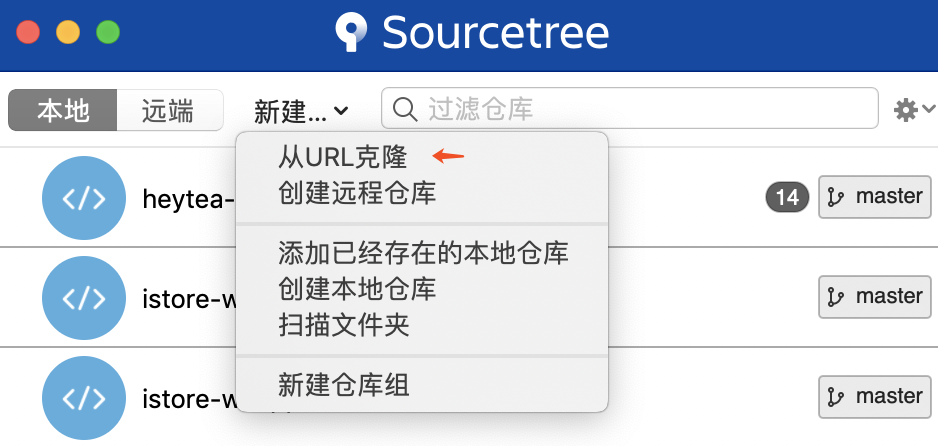
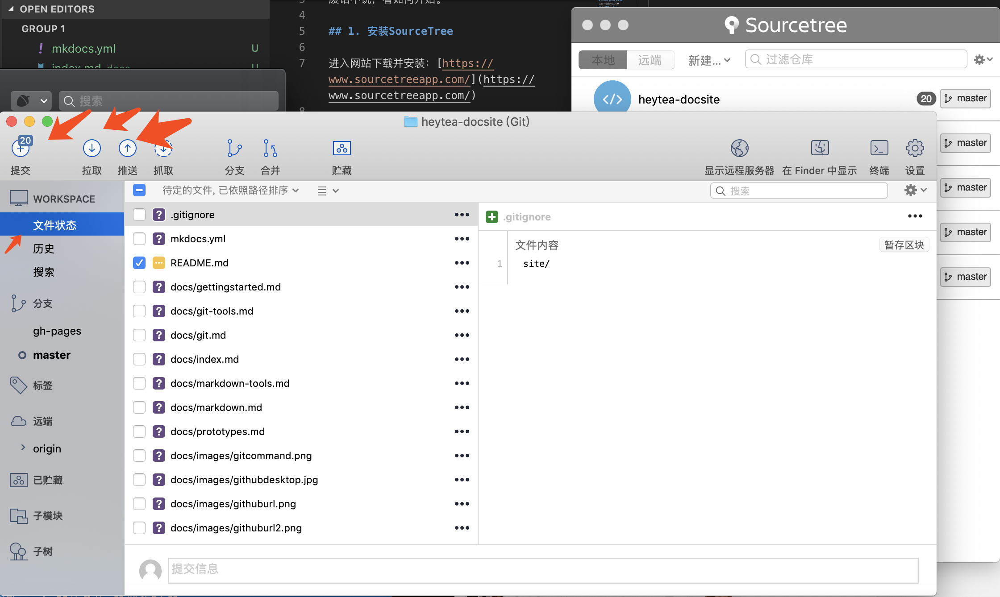
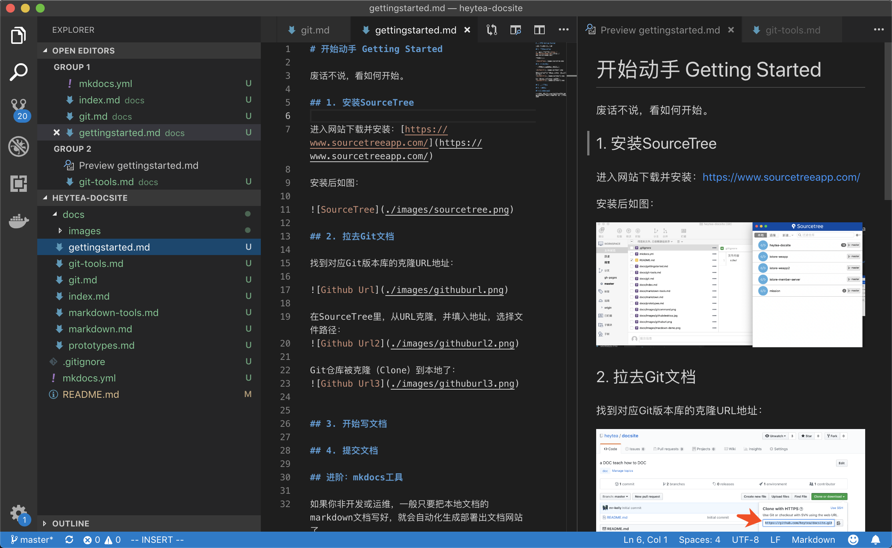
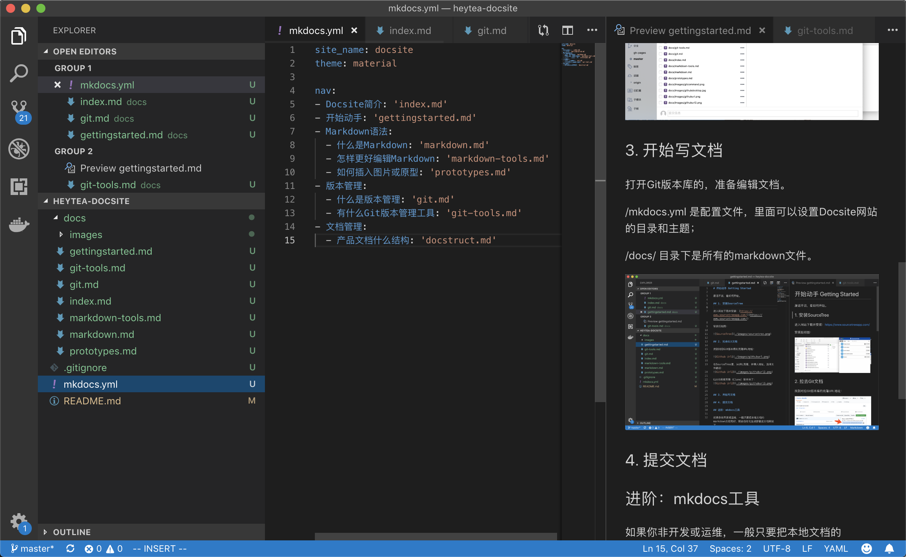
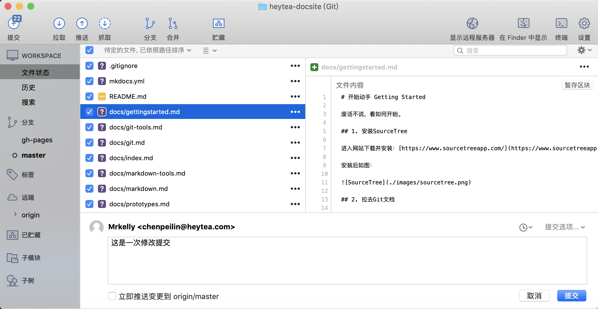

# 开始动手 Getting Started

废话不说，看如何开始。

## 1. 安装SourceTree

进入网站下载并安装：[https://www.sourcetreeapp.com/](https://www.sourcetreeapp.com/)

安装后如图：

## 2. 拉取Git文档

找到对应Git版本库的克隆URL地址：

在SourceTree里，从URL克隆，并填入地址，选择文件路径：

Git仓库被克隆（Clone）到本地了：

## 3. 开始写文档

打开Git版本库的，准备编辑文档。

/mkdocs.yml 是配置文件，里面可以设置Docsite网站的目录和主题；

/docs/ 目录下是所有的markdown文件。

## 4. 提交文档

回到SourceTree，点击左上角“提交”按钮，进入提交页面。

填写提交信息，并按右下角“提交”按钮进行提交。

至此，文档提交完成。服务器端将进行自动生成网站处理。
