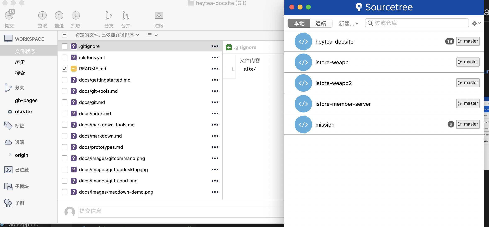
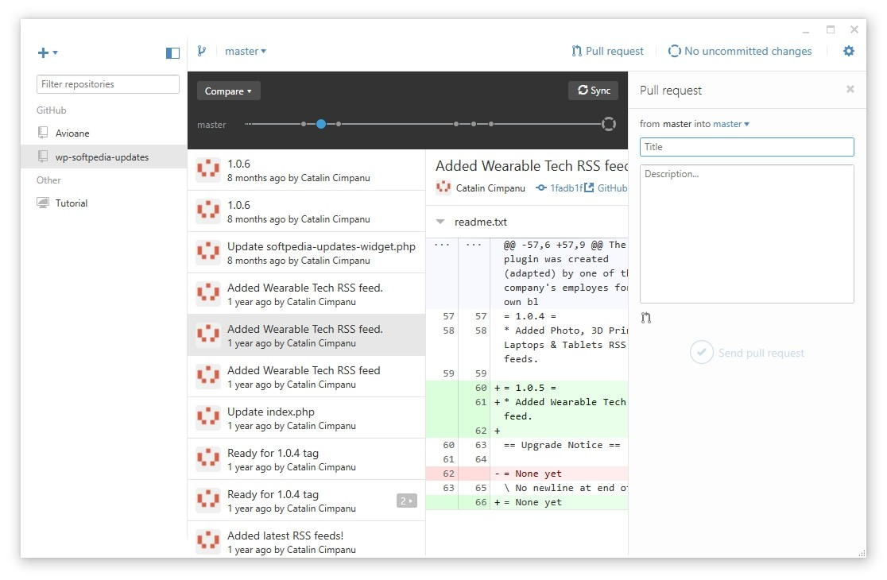
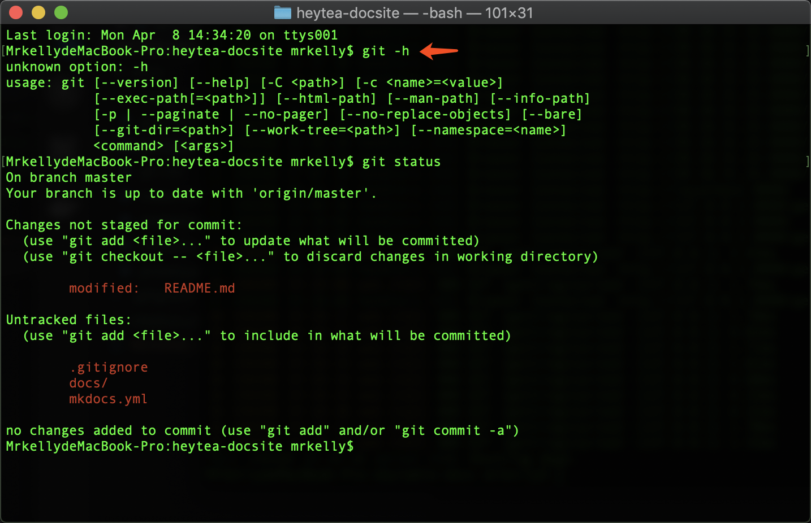

# Git版本管理

## 网站

### Github

注意了，很多人分不清Git和Github什么关系。

Git是版本管理工具，Github是一个网站，上面存放着全世界各种各样的Git版本库。

也有很多人误会Git是一个程序员的工具，Git是版本管理工具，像有很多的网站、文档、论文、新闻，都在使用Github。

### Gitlab

一个Git仓库管理网站系统，你可以理解为，它是一个我们自己的Github私有化版。

我们的代码工程都存放在上面，并且围绕它做各种各样的产品管理、研发管理、文档管理。

## 工具

Git版本库的管理工具。

### SourceTree

SourceTree作为Git管理工具，免费，全平台通用。

[https://www.sourcetreeapp.com/](https://www.sourcetreeapp.com/)

### Github Desktop

Github官方出品的Git管理工具，比较简单易用。

[https://desktop.github.com/](https://desktop.github.com/)

### Git命令

你也可以直接使用Git命令进行版本管理操作。

