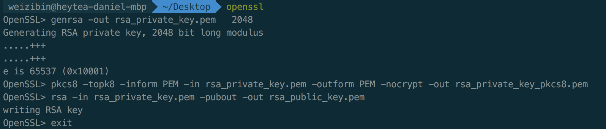

# 签名接口对接协议规则 V2

## API 接口对接协议

对接接口采用 RESTful 设计风格。

 - | -
------------ | -------------
传输协议 | HTTPS
Content-Type | application/json;charset=utf-8
字符编码 | UTF-8
签名算法 | SHA256-RSA
签名要求 | 请求时，必须携带签名
时效要求 | 时效性验证，早于或晚于 5 分钟的请求，将被拒绝


## API 接口请求 Body 参数

HTTP 请求 body 必须是一个 JSON，并且必须包含以下公共请求参数：

字段名 | 类型 | 是否必填 | 描述 | 示例
------- | ------- | ------- | ------- | -------
clientId | String | 是 | 喜茶分配给第三方商户的 client ID | exampleClientID
timestamp | String | 是 | 创建签名时的时间戳，单位：秒 | 1600412480
payload | JSON | 是 | 请求正文，业务数据都需要封装在这个字段里面，否则不会参与接口签名验证 | {"order":"3423768327","action":"pay"}
sign | String | 是 | 签名结果  | dFCBnsgzv/2h...

示例：

```
{
    "clientId": "exampleClientID",
    "timestamp": "1600412480",
    "payload": {"order":"3423768327","action":"pay"},
    "sign": "dFCBnsgzv/2h..."
}
```


## 生成 RSA 密钥 [可选]

如果已经有 RSA 密钥对，可以跳过这一节。

### 安全要求

第三方商户生成 RSA 密钥对，将公钥提供给喜茶，自己保留私钥（务必保管好私钥）。

喜茶将商户的公钥加入系统中，这样，商户就可以和喜茶系统进行安全数据交换。其中，公私密钥对可以参考下面的方法进行生成。生产环境密钥对禁止使用在开发和测试环境。

### 使用 OpenSSL 工具生成公私密钥

首先进入 OpenSSL 工具，再输入以下命令。

```
## 进入 openssl
$ openssl

## 生成私钥
OpenSSL> genrsa -out rsa_private_key.pem 2048

## Java 开发者需要将私钥转换成 PKCS8 格式
OpenSSL> pkcs8 -topk8 -inform PEM -in rsa_private_key.pem -outform PEM -nocrypt -out rsa_private_key_pkcs8.pem

## 生成公钥
OpenSSL> rsa -in rsa_private_key.pem -pubout -out rsa_public_key.pem

## 退出 OpenSSL
OpenSSL> exit
```

#### 生成后得到密钥
- 私钥：rsa_private_key_pkcs8.pem
- 公钥：rsa_public_key.pem

#### 示例



## API 接口签名生成

### 签名生成流程

1. 参数排序
2. 参数拼接
3. 计算待签名字符串签名

#### 参数排序

获取所有公共请求参数，剔除 sign 字段，并按照第一个字符的键值 ASCII 码递增排序（字母升序排序），如果遇到相同字符则按照第二个字符的键值 ASCII 码递增排序，以此类推。

#### 参数拼接

将排序后的参数与其对应值，组合成“参数=参数值”的格式，并且把这些参数用 & 字符连接起来，此时生成的字符串为待签名字符串。

#### 计算待签名字符串签名

使用对应的 SHA256-RSA 签名函数传入商户私钥对待签名字符串进行签名，并进行 Base64 编码，计算结果即为 sign。

### 示例

#### 准备示例数据
1. clientId = exampleClientID
2. timestamp = 1600412480
3. private-key = MIIEvQIBADANBgkqhkiG9w0BAQEFAASCBKcwggSjAgEAAoIB...
4. payload = {"aaa":"dddd"}

#### 排序拼接字符串

待签名字符串

```
clientId=exampleClientID&payload={"aaa":"dddd"}&timestamp=1600412480
```

#### 计算签名

1. 使用 SHA256-RSA 传入商户私钥对待签名字符串进行签名
2. 对生成的签名进行 Base64 编码

Java 示例代码
```

import java.security.KeyFactory;
import java.security.PrivateKey;
import java.security.PublicKey;
import java.security.Signature;
import java.security.spec.PKCS8EncodedKeySpec;
import java.security.spec.X509EncodedKeySpec;
import java.util.Base64;

import org.junit.jupiter.api.Test;

public class SignTest {

    @Test
    public void testSign() throws Exception {

        // @formatter:off
        String privateKeyString = "MIIEvQIBADANBgkqhkiG9w0BAQEFAASCBKcwggSjAgEAAoIBAQCxmSTPSSvDhPqM"
            + "mL6goPDUs0kuHFEmg55GvOF2ujFVCcUzcIBEwihiBCDcXKm5ursPGbGV55mi2ybc"
            + "iEGvDR0i9sZqSuMBHsmq+kpFBSFCzfrLRd8Mt8GK5OGbNTBmnjBNMS/q9+m99z34"
            + "B9ocURMw7TNx98vXwuLmXRiCLStTBDz0NgzhrXsrfON0rD5xnxzPw0+1BRJ0g6Da"
            + "br0OFOL9n9PUwrglF8IeD/+XPnDkvYktHS608XXaSQk3wdE2RlWszOAHrpoOjBVQ"
            + "Es+aSWMVb268MlOzjY4IYe1mDcT+reP9yY6rr00tWF9eLm6rKMRPA4R4i8uBPY1r"
            + "vxYvRwX/AgMBAAECggEAGGvqt+Zj8jrzCSpn7Ea1V0pgIcsbDaTDuw52IpFv/zWc"
            + "vHoX6VyZmQDgU+0aGcQnvOfXl7mFUvO34FOMVLoE663rkupBVQIa0TwhwmP2Mu2I"
            + "MzOkfGc4YhUfQOyLf1D5a2P8Jt94cPrytoy93W74qJ21mVJt4XmXIf5jRGNZtcyA"
            + "lYxHigbVGjePrYk4yuOmK8KIs6f4ny6nRuqdcLv/PG20YHYXth7xHI4LGlgElkXl"
            + "o2JEjFkpadfYw7+8Gede6WdUCAJWhssaja7HW5MhlYQxn4MwosEAr7n64/8UAdkn"
            + "rW51GqvUfGj9pRAQRs0JIYmq2alfaJ8O82/pHC0SAQKBgQDmDFowUgRZ3l2YA0yX"
            + "Sgeq5TXMuDzIMvWfQUHvIbU1vvrNQnGWyIDLsLHEYkgQ5g6Es+FBK/nA45bqhhyh"
            + "wxnoJjba6VSvS1bgcIoITCTCocmRTMJwf6XeYr2HDTVOsqBfFXN0ZpWwTlXFb7xJ"
            + "TBpYGZq7TV2qH8biWp+1zrOyvwKBgQDFohFZQd932sucp4w97v4/JF5X+XfVsxaD"
            + "4hHAToGJx/343/eWgRob8C0Kc0Er45Hugd9TCuhROmGZMc0voW83h//hART8zAY9"
            + "mZ3FFFmoRgiEXFMixztUua2kjuAwRugXwLvW+JpgEwJQz7ff3UICzdD4V7ciHpTK"
            + "lYeOZLe8wQKBgQCrSK8uIyMSNrrBIFO6oWgsGhWAo/y9oxO2y8Pn5NUje1sJ0Vr5"
            + "xbf/8UOq0PKPgnt02unwuGlw8QPBArH2z2lOrIVTYT+odRPucFyV6PvF3uhRwzFS"
            + "yfgaKLKtB2yVd/JoWXRpSqhRaUH7i0JJ4NwMlKPcqbH/pUFT793SZGDvyQKBgB6v"
            + "BeCEwKw8FQayYKyw8VpeTCN+gON11ZYOQFFKHwSEP2Mnaqo8SxBxXpzTvheRUnPk"
            + "SAb9l4oc9VAykjfF6Z2GiOynHVoOVx2zPvJ9MVpV3TanmuS4Z/bEiTgWUqpMJ/ag"
            + "HsnGeTlXWjGvvk2MbZY/3CTigXVTqCg3xP8PlhNBAoGAWRmvZle+WIGAV2g+R+FP"
            + "JmEWYRcO3E/KQiYBy50gInnWq0p1ZL6RGaBdqXCJP7FFGppdMH1aXmfXQQ7vENQg"
            + "xqa3ACfFCsOMSUGy1HxQ0/pp3KOYmUE6faDo0FB2AJFNtKa0rTP10BPhjGpjgsR+"
            + "CMLlUC9TTKOAoTg5r3QpxKM=";
        // @formatter:on

        // Long timestamp = Instant.now().getEpochSecond(); // 1600761549 1600412480
        String toSignString = "clientId=exampleClientID&payload={\"aaa\":\"dddd\"}&timestamp=1600412480";

        PKCS8EncodedKeySpec keySpec = new PKCS8EncodedKeySpec(Base64.getDecoder().decode(privateKeyString));
        KeyFactory fac = KeyFactory.getInstance("RSA");
        PrivateKey priKey = fac.generatePrivate(keySpec);

        Signature sigEng = Signature.getInstance("SHA256withRSA");
        sigEng.initSign(priKey);
        sigEng.update(toSignString.getBytes());
        byte[] signature = sigEng.sign();
        String sign = Base64.getEncoder().encodeToString(signature);

        System.out.println(sign);
        // foHCGM7eyNVx11jVLtjGv16xAM5Y4+m2NvxsfGQhM25q+gGewgDzbPhvTn/W3w1TuNIUfZLCtlUaU/mBLTUw6Z0AWXxWLseA9vUdiZTENcwdIArHgN9VyKwCEopDQwT1GRaBx/V1Rp7nEywyC4MDyImUBLEmehXZT4vh0hSYOtQ7/Oaku0jf5hEULyGCwIWSettWoO3QAjB9Dmim4I5WSG2NcChwVSPGv6ucjDGfCTXVPNR8CtgjDJimRDbehqPBy36MZHWIgKDuRnf9NrIai1+JHnJCUHAhRWpBYGERpiWpS0XEAn4OGmo7K8xDdexHjXt3yZ0pyWJ2o8pAQKDCTw==

    }

    @Test
    public void verifySign() throws Exception {

        // @formatter:off
        String publicKeyString = "MIIBIjANBgkqhkiG9w0BAQEFAAOCAQ8AMIIBCgKCAQEAsZkkz0krw4T6jJi+oKDw"
            + "1LNJLhxRJoOeRrzhdroxVQnFM3CARMIoYgQg3Fypubq7DxmxleeZotsm3IhBrw0d"
            + "IvbGakrjAR7JqvpKRQUhQs36y0XfDLfBiuThmzUwZp4wTTEv6vfpvfc9+AfaHFET"
            + "MO0zcffL18Li5l0Ygi0rUwQ89DYM4a17K3zjdKw+cZ8cz8NPtQUSdIOg2m69DhTi"
            + "/Z/T1MK4JRfCHg//lz5w5L2JLR0utPF12kkJN8HRNkZVrMzgB66aDowVUBLPmklj"
            + "FW9uvDJTs42OCGHtZg3E/q3j/cmOq69NLVhfXi5uqyjETwOEeIvLgT2Na78WL0cF"
            + "/wIDAQAB";
        // @formatter:on

        String toSignString = "clientId=exampleClientID&payload={\"aaa\":\"dddd\"}&timestamp=1600412480";

        String signData =
            "foHCGM7eyNVx11jVLtjGv16xAM5Y4+m2NvxsfGQhM25q+gGewgDzbPhvTn/W3w1TuNIUfZLCtlUaU/mBLTUw6Z0AWXxWLseA9vUdiZTENcwdIArHgN9VyKwCEopDQwT1GRaBx/V1Rp7nEywyC4MDyImUBLEmehXZT4vh0hSYOtQ7/Oaku0jf5hEULyGCwIWSettWoO3QAjB9Dmim4I5WSG2NcChwVSPGv6ucjDGfCTXVPNR8CtgjDJimRDbehqPBy36MZHWIgKDuRnf9NrIai1+JHnJCUHAhRWpBYGERpiWpS0XEAn4OGmo7K8xDdexHjXt3yZ0pyWJ2o8pAQKDCTw==";

        X509EncodedKeySpec keySpec = new X509EncodedKeySpec(Base64.getDecoder().decode(publicKeyString));
        KeyFactory fac = KeyFactory.getInstance("RSA");
        PublicKey pubKey = fac.generatePublic(keySpec);

        Signature sigEng = Signature.getInstance("SHA256withRSA");
        sigEng.initVerify(pubKey);
        sigEng.update(toSignString.getBytes());
        boolean result = sigEng.verify(Base64.getDecoder().decode(signData));

        System.out.println(result);
    }

}

```


## 问题自助排查

### 根据喜茶网关返回的 message 排查

Message | 描述 | 解决方案
---------- | -------- | --------
body empty | 请求体不能为空 | 检查请求体是否为空
client not exists | 商户未配置在喜茶网关 | 检查 clientId 是否填写错误，联系喜茶开发检查网关是否配置商户
request timestamp too late or early | 请求时效校验错误 | 检查传参时间是否准确
sign uncorrected | 签名验证失败 | 检查密钥配置、签名算法是否有误
unknown system error | 系统错误 | 联系喜茶排查并提供请求参数


